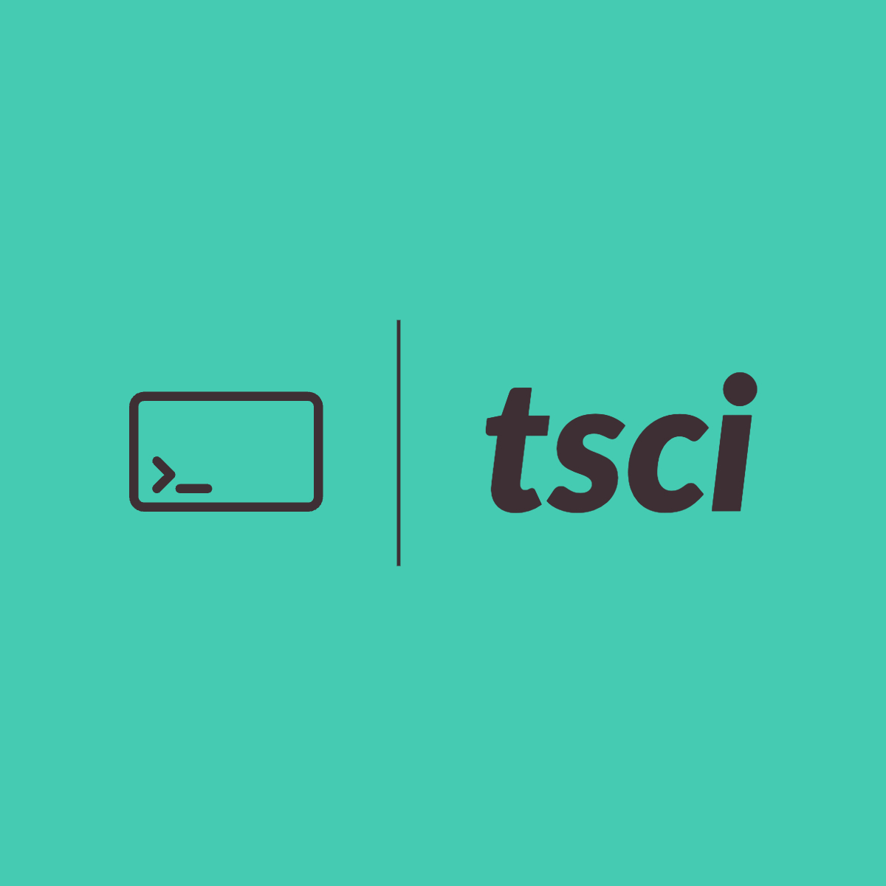
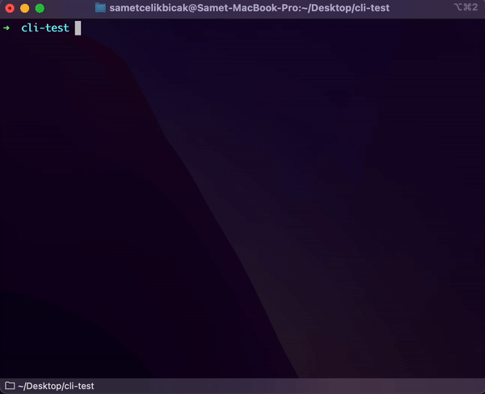

<div align="center">



# TSCI CLI
  [](https://github.com/sametcelikbicak/tsci/actions/workflows/codeql-analysis.yml) [](https://github.com/sametcelikbicak/tsci/actions/workflows/build-test.yml) [](https://github.com/sametcelikbicak/tsci/actions/workflows/coverage.yml) 


TypeScript CLI for creating HTML & CSS & TypeScript project with different bundlers.
</div>

## Installation
``` shell
npm i -g tsci
```
## Options
``` shell
tsci --help
Usage: tsci [options]

Options:
  -v, --version  output the version number
  -h, --help     display help for command
```

## Usage


### Want to contribute?
You can read and follow our [CONTRIBUTING.md](CONTRIBUTING.md) and report it using
[GitHub Issues](https://github.com/sametcelikbicak/tsci/issues)! for reporting bugs, suggesting enhancements, bugfixes, new features and extras are welcome.


## Contributors ✨
<!-- ALL-CONTRIBUTORS-BADGE:START - Do not remove or modify this section -->
[](#contributors-)
<!-- ALL-CONTRIBUTORS-BADGE:END -->
Thanks goes to these wonderful people ([emoji key](https://allcontributors.org/docs/en/emoji-key)):


<!-- ALL-CONTRIBUTORS-LIST:START - Do not remove or modify this section -->
<!-- prettier-ignore-start -->
<!-- markdownlint-disable -->
<table>
  <tbody>
    <tr>
      <td align="center"><a href="https://sametcelikbicak.com/"><br /><sub><b>Samet ÇELİKBIÇAK</b></sub></a><br /><a href="#infra-sametcelikbicak" title="Infrastructure (Hosting, Build-Tools, etc)">🚇</a> <a href="https://github.com/sametcelikbicak/tsci/commits?author=sametcelikbicak" title="Code">💻</a> <a href="https://github.com/sametcelikbicak/tsci/issues?q=author%3Asametcelikbicak" title="Bug reports">🐛</a> <a href="https://github.com/sametcelikbicak/tsci/commits?author=sametcelikbicak" title="Documentation">📖</a> <a href="#example-sametcelikbicak" title="Examples">💡</a> <a href="#maintenance-sametcelikbicak" title="Maintenance">🚧</a> <a href="https://github.com/sametcelikbicak/tsci/commits?author=sametcelikbicak" title="Tests">⚠️</a></td>
    </tr>
  </tbody>
</table>
<!-- markdownlint-restore -->
<!-- prettier-ignore-end -->

<!-- ALL-CONTRIBUTORS-LIST:END -->


This project follows the [all-contributors](https://github.com/all-contributors/all-contributors) specification. Contributions of any kind welcome!

